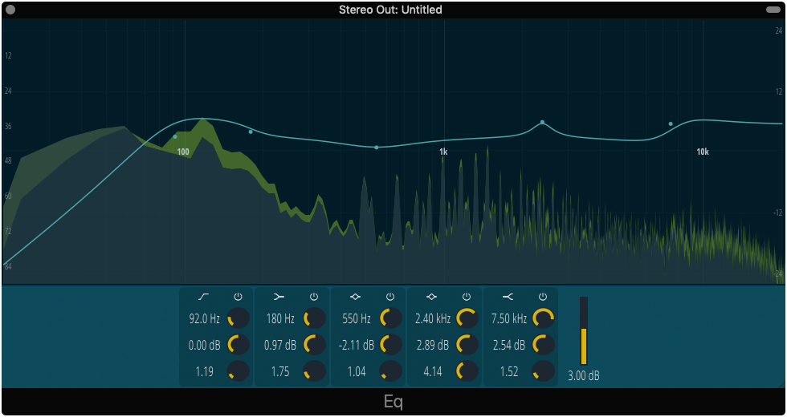

## Eq
 
 

An equalizer plugin made with the Juce framework. My attempt at writing a simple but fully functional audio plugin, customizing Juce's LookAndFeel class and the behavior of some components. Work In Progress.
 
 

## Dependencies
Juce: https://github.com/WeAreROLI/JUCE (develop branch)
 
 

## Credits
The spectrum analyzer has code from https://github.com/ffAudio/Frequalizer for the fifo's and the overall analyzer's curve drawing.

The main font is Steve Matteson's Open Sans Condensed: 
https://fonts.google.com/specimen/Open+Sans+Condensed

Icons from Fefanto's FontAudio: 
https://github.com/fefanto/fontaudio
 
 

## License
GPL-3.0
